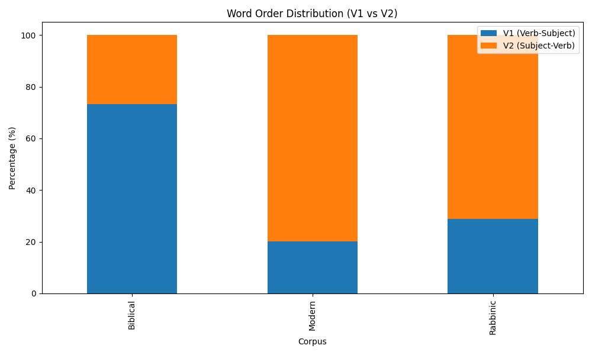
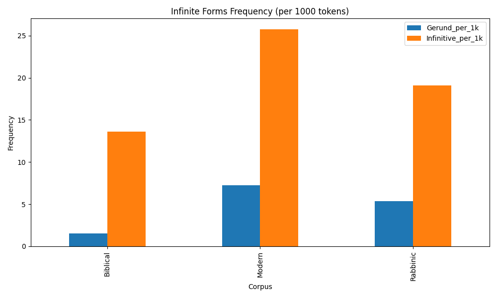
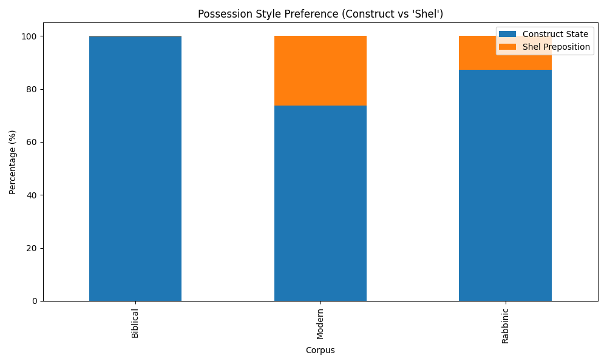

# דוח מחקר סופי: השוואת עברית מודרנית למקורות
**תאריך:** 09/12/2025
**צוות:** אושר כהן, יותם צור, שיר בן אדרת, עומרי הירש, שניר בוקריס

---

## תקציר
דוח זה מציג את ממצאי הניתוח הממוחשב שנערך על קורפוסים של עברית מקראית, חז"לית ומודרנית.
המטרה: לבחון את השערת פרופ' עידית דורון בדבר "הדילוג ההיסטורי" של העברית המודרנית אל המקרא.

---

## 1. השורה התחתונה: ניתוח דמיון וקטורי
טבלה זו מציגה את המרחק האוקלידי בין הקורפוסים. ערך נמוך יותר מצביע על דמיון רב יותר.

|          |   Biblical |   Modern |   Rabbinic |
|:---------|-----------:|---------:|-----------:|
| Biblical |     0      |  11.3327 |    24.0124 |
| Modern   |    11.3327 |   0      |    35.1455 |
| Rabbinic |    24.0124 |  35.1455 |     0      |

### פרשנות המרחקים
המרחק האוקלידי בין וקטורי הפיצ'רים הממוצעים מראה כי העברית המודרנית **קרובה יותר למקרא**.
* מרחק מהמקרא: **11.3327**
* מרחק מחז"ל: **35.1455**

משמעות הדבר היא שבשקלול כלל המאפיינים שנבדקו (תחביר, מורפולוגיה, לקסיקון), הדמיון הווקטורי נוטה לכיוון המצוין לעיל.

## 2. מבנה תחבירי: סדר מילים (V1 vs V2)

### נתונים גולמיים ואחוזים
| corpus   |   is_v1 |   is_v2 |   V1_percent |   V2_percent |
|:---------|--------:|--------:|-------------:|-------------:|
| Biblical |    2061 |     750 |        73.32 |        26.68 |
| Modern   |   35043 |  139149 |        20.12 |        79.88 |
| Rabbinic |    3616 |    8898 |        28.9  |        71.1  |

### פרשנות
במחקר הבלשני, המקרא מאופיין במבנה V1 (פועל לפני נושא - VSO), בעוד לשון חז"ל והעברית המודרנית נוטות למבנה V2 (נושא לפני פועל - SVO).
הגרף והטבלה לעיל מאפשרים לראות האם המודרנית אכן מציגה דפוס מובהק של V2 כמו חז"ל, או שישנה חזרה מסוימת למבני V1 המקראיים (במיוחד במשלבים גבוהים או ספרותיים).

## 3. צורות מקור (Gerund vs Infinitive)

### שכיחות מנורמלת (ל-1000 מילים)
| corpus   |   Gerund_per_1k |   Infinitive_per_1k |
|:---------|----------------:|--------------------:|
| Biblical |            1.54 |               13.61 |
| Modern   |            7.22 |               25.74 |
| Rabbinic |            5.33 |               19.09 |

### פרשנות
פרופ' דורון טוענת כי העברית המודרנית החזירה לשימוש את ה-Gerund (שם פועל נטוי או עם נושא) שהיה נפוץ במקרא ונעלם בלשון חז"ל.
* **Infinitive:** שם פועל רגיל ("ללכת").
* **Gerund:** שם פועל המתפקד כפועל עם נושא ("בליכתו", "בהיות המלך").

עלייה בשכיחות ה-Gerund במודרנית לעומת חז"ל תהווה תמיכה בטענת "הדילוג ההיסטורי".

## 4. הבעת שייכות (Possession)

### יחס סמיכות מול 'של'
| corpus   |   cnt_poss_construct |   cnt_poss_shel |   Construct_Shel_Ratio |
|:---------|---------------------:|----------------:|-----------------------:|
| Biblical |                 6542 |              18 |                 363.44 |
| Modern   |               242863 |           86503 |                   2.81 |
| Rabbinic |                50623 |            7477 |                   6.77 |

### פרשנות
* **מקרא:** שימוש כמעט בלעדי בסמיכות (Construct State).
* **חז"ל:** מעבר נרחב לשימוש במלית היחס "של".
* **מודרנית:** שימוש מעורב.

היחס (Ratio) בטבלה מציג פי כמה נפוצה הסמיכות מאשר "של". ערך גבוה מעיד על סגנון מקראי/גבוה יותר.

## 5. העדפות לקסיקליות (זוגות דורון)

### ספירת מופעים לזוגות מייצגים
| corpus   |   cnt_biblical_pairs |   cnt_mishnaic_pairs |
|:---------|---------------------:|---------------------:|
| Biblical |                  269 |                   91 |
| Modern   |                 8249 |                 1829 |
| Rabbinic |                 2608 |                  935 |

### פרשנות
נבדקו זוגות מילים נרדפות שבהן אחת מזוהה עם המקרא (כגון: עץ, שמש, אף) והשנייה עם חז"ל (אילן, חמה, חוטם).
דומיננטיות של הטור המקראי בקורפוס המודרני מעידה על בחירה לקסיקלית המדלגת על רובד חז"ל.
