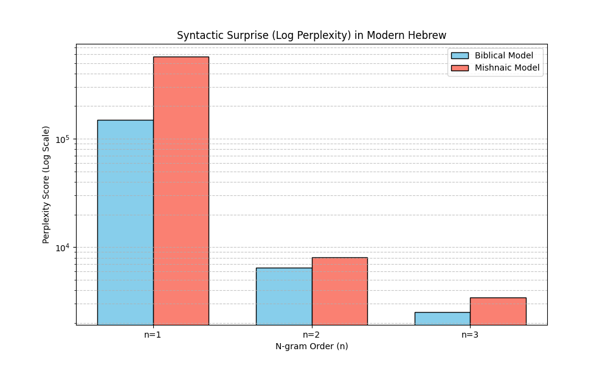

# Perplexity Analysis Report

**Date:** [Current Date]

## 1. Overview
This report analyzes the Perplexity (PPL) score of Modern Hebrew text using language models trained on either Biblical or Mishnaic corpora. Perplexity is a measurement of how "surprised" a model is by a new text.

*   **Lower Perplexity** = Higher similarity/predictability.
*   **Higher Perplexity** = Lower similarity.

## 2. Methodology
To ensure the analysis focuses on syntax and structure rather than surface-level differences (like vowel pointing or spelling variants), the models are trained on:

1.  **Lemmas (lex):** The dictionary root of each word provided by the Dicta analyzer.
2.  **POS Tags (pos):** Abstract syntactic categories (Verb, Noun, ADP, etc.) to test pure structural similarity.

### Algorithm
We use an **N-gram Language Model with Lidstone Smoothing** ($\gamma=0.1$). Smoothing is essential to handle "Out-of-Vocabulary" (OOV) words—modern terms that do not appear in ancient corpora.

The analysis is performed at three levels of granularity:
*   **n=1 (Unigram):** Measures vocabulary depth and overall "word bank" overlap.
*   **n=2 (Bigram):** Measures local syntax and immediate word pairings.
*   **n=3 (Trigram):** Measures sentence structure and the "rhythm" of the language.

## 3. Results Visualization

*(Note: Lower bars indicate higher similarity to Modern Hebrew)*

## 4. Interpretation Guide

*   **Vocabulary Depth (n=1):** The model with the lower bar indicates which historical period shares the most individual words and lemmas with the modern corpus.
*   **Local Syntax (n=2):** The model with the lower bar suggests that the local, short-range syntactic patterns of the modern text are more predictable based on that specific historical layer.
*   **Sentence Structure (n=3):** The model with the lower bar indicates which historical period’s overarching structural "DNA" is most prevalent in the modern language. This provides the strongest evidence for claims regarding long-term syntactic continuity.

## 5. Source Code
The analysis tool is located in `src/analysis/perplexity/` and includes:
*   `main.py`: Pipeline orchestrator.
*   `data_loader.py`: Recursive JSON parser.
*   `calculate_perplexity.py`: N-gram model and PPL logic.

